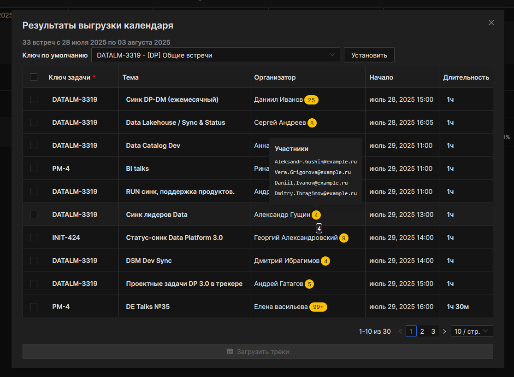
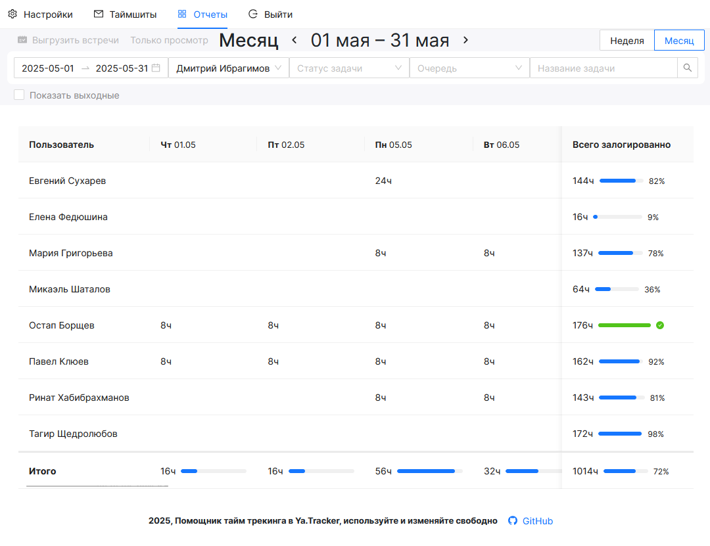
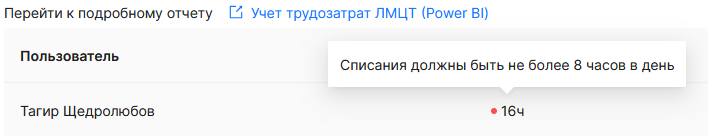
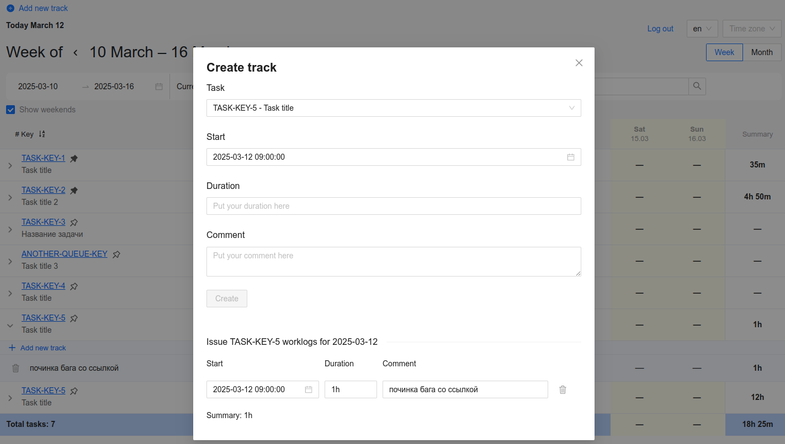
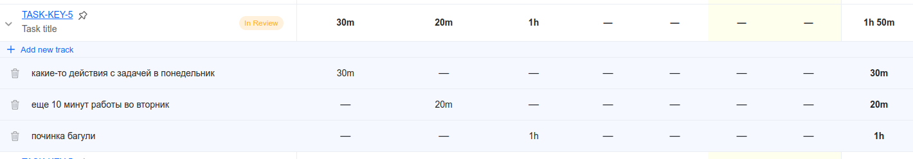
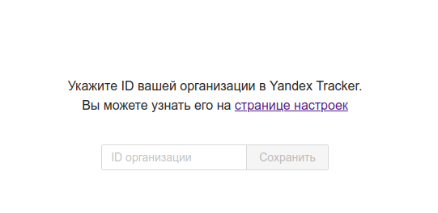

# 🕒 Timesheet - Учет рабочего времени в Yandex Tracker для разработчиков

[![DeepWiki](https://img.shields.io/badge/DeepWiki-diarworld%2Ftimesheeter-blue.svg?logo=data:image/png;base64,iVBORw0KGgoAAAANSUhEUgAAACwAAAAyCAYAAAAnWDnqAAAAAXNSR0IArs4c6QAAA05JREFUaEPtmUtyEzEQhtWTQyQLHNak2AB7ZnyXZMEjXMGeK/AIi+QuHrMnbChYY7MIh8g01fJoopFb0uhhEqqcbWTp06/uv1saEDv4O3n3dV60RfP947Mm9/SQc0ICFQgzfc4CYZoTPAswgSJCCUJUnAAoRHOAUOcATwbmVLWdGoH//PB8mnKqScAhsD0kYP3j/Yt5LPQe2KvcXmGvRHcDnpxfL2zOYJ1mFwrryWTz0advv1Ut4CJgf5uhDuDj5eUcAUoahrdY/56ebRWeraTjMt/00Sh3UDtjgHtQNHwcRGOC98BJEAEymycmYcWwOprTgcB6VZ5JK5TAJ+fXGLBm3FDAmn6oPPjR4rKCAoJCal2eAiQp2x0vxTPB3ALO2CRkwmDy5WohzBDwSEFKRwPbknEggCPB/imwrycgxX2NzoMCHhPkDwqYMr9tRcP5qNrMZHkVnOjRMWwLCcr8ohBVb1OMjxLwGCvjTikrsBOiA6fNyCrm8V1rP93iVPpwaE+gO0SsWmPiXB+jikdf6SizrT5qKasx5j8ABbHpFTx+vFXp9EnYQmLx02h1QTTrl6eDqxLnGjporxl3NL3agEvXdT0WmEost648sQOYAeJS9Q7bfUVoMGnjo4AZdUMQku50McDcMWcBPvr0SzbTAFDfvJqwLzgxwATnCgnp4wDl6Aa+Ax283gghmj+vj7feE2KBBRMW3FzOpLOADl0Isb5587h/U4gGvkt5v60Z1VLG8BhYjbzRwyQZemwAd6cCR5/XFWLYZRIMpX39AR0tjaGGiGzLVyhse5C9RKC6ai42ppWPKiBagOvaYk8lO7DajerabOZP46Lby5wKjw1HCRx7p9sVMOWGzb/vA1hwiWc6jm3MvQDTogQkiqIhJV0nBQBTU+3okKCFDy9WwferkHjtxib7t3xIUQtHxnIwtx4mpg26/HfwVNVDb4oI9RHmx5WGelRVlrtiw43zboCLaxv46AZeB3IlTkwouebTr1y2NjSpHz68WNFjHvupy3q8TFn3Hos2IAk4Ju5dCo8B3wP7VPr/FGaKiG+T+v+TQqIrOqMTL1VdWV1DdmcbO8KXBz6esmYWYKPwDL5b5FA1a0hwapHiom0r/cKaoqr+27/XcrS5UwSMbQAAAABJRU5ErkJggg==)](https://deepwiki.com/diarworld/timesheeter)

> **Устали от неудобного учета времени в Yandex Tracker?** Timesheet — это современное решение, созданное разработчиками для разработчиков, которое превращает рутинный процесс учета рабочего времени в удовольствие (ну или хотябы не такой рутинный).

📖 **[Пользовательская документация](https://diarworld.github.io/timesheeter/user_doc)**

## ✨ Что делает Timesheet особенным?

Timesheet родился из реальной боли разработчиков. Yandex Tracker отлично управляет задачами, но его возможности по учету времени оставляют желать лучшего. Мы создали инструмент, который:

- 🚀 **Автоматизирует** выгрузку встреч из календаря в трекер
- 📊 **Визуализирует** отчеты о затраченном времени
- ⚡ **Ускоряет** создание и редактирование треков
- 🎯 **Упрощает** управление командой

## 🎯 Ключевые возможности

### 📅 Интеграция с календарем (Outlook/Exchange)
Массово выгружайте встречи из календаря прямо в ворклоги Yandex Tracker:


### 📈 Детальные отчеты
Получайте полную картину затраченного времени с красивой визуализацией:


### 🚨 Мониторинг ошибок
Отслеживайте проблемы со списанием времени в реальном времени:


### 👥 Управление командой
Добавляйте и удаляйте участников команды с легкостью:


### 📋 Таблица треков
Просматривайте треки по задачам в удобной таблице с автоматическим подсчетом времени:
- Задачи назначаются на текущего пользователя
- Фильтрация по датам создания/обновления
- Отображение закрепленных задач
- Фильтры по ответственному, статусам, очередям

### 📌 Закрепление задач
Закрепляйте важные задачи одним кликом — они всегда будут в таблице:


### ⚡ Быстрое создание треков
Создавайте треки несколькими способами:
- Клик по ячейке в таблице
- Кнопка "Add new track"
- Модальные окна с предзаполненными данными



### 🔧 Гибкое редактирование
Редактируйте треки прямо в таблице или через модальные окна:


## 🚀 Быстрый старт

### Предварительные требования
- [NodeJS](https://www.digitalocean.com/community/tutorials/node-js-ubuntu-18-04-ru#Установка-при-помощи-nvm)
- Настроенные переменные окружения (см. таблицу ниже)

### Переменные окружения

| Переменная | Тип | Описание | Обязательно |
|------------|-----|----------|-------------|
| `CLIENT_ID` | string | Yandex OAuth2 App ID | ✅ Да |
| `ENCRYPTION_KEY` | string | Salt for encripting LDAP passwords | ✅ Да |
| `DATABASE_URL` | string | PostgreSQL подключение | ✅ Да |
| `EWS_SERVICE_URL` | string | Exchange Web Services URL | ❌ Нет |
| `EWS_DOMAIN` | string | Домен для EWS аутентификации | ❌ Нет |
| `DIFY_API_TOKEN` | string | API токен для AI функциональности | ❌ Нет |
| `DIFY_URL` | string | URL сервиса Dify | ❌ Нет |
| `DIFY_COST` | number | Стоимость AI запроса | ❌ Нет |
| `SHADOW_DATABASE_URL` | string | Теневая БД для миграций | ❌ Нет |
| `SUPPORT_URL` | string | URL канала поддержки | ❌ Нет |
| `RESTORE_PASSWORD_URL` | string | URL восстановления пароля | ❌ Нет |
| `COMPANY_DOMAIN` | string | Домен компании | ❌ Нет |
| `COMPANY_POWERBI_URL` | string | URL PowerBI дашборда для отчетов | ❌ Нет |
| `COMPANY_OPENREPLAY_KEY` | string | API ключ для сервиса OpenReplay (запись сессий) | ❌ Нет |
| `COMPANY_OPENREPLAY_URL` | string | URL сервиса OpenReplay | ❌ Нет |

### 🛠️ Установка и запуск

```bash
# Установка зависимостей
npm ci

# Сборка проекта
npm run build

# Запуск в продакшене
npm run start

# Запуск в режиме разработки
npm run dev
```

### 🐳 Docker

```bash
# Сборка образа
docker build -t timesheet .

# Запуск контейнера
docker run -ti -e CLIENT_ID=YOUR_CLIENT_ID -p 3000:3000 timesheet

# Или через docker-compose
docker-compose up --build
```

### 🔧 Настройка Yandex OAuth

1. Перейдите на [Yandex OAuth](https://passport.yandex.com/auth?retpath=https%3A%2F%2Foauth.yandex.com%2Fclient%2Fnew&noreturn=1&origin=oauth)
2. Создайте новое приложение
3. Укажите настройки:
   - **Hostname**: `https://your-domain.com`
   - **Redirect URI**: `https://your-domain.com/token`
   - **Доступы**: `tracker:read`, `tracker:write`

### 🏢 Первый запуск

При первом запуске необходимо указать ID организации, который можно найти по ссылке: https://tracker.yandex.com/admin/orgs



## 🐛 Решение проблем

### Chrome ошибка 400 Bad Request
В режиме разработки иногда возникает ошибка из-за устаревших куков. **Решение**: очистите куки в настройках браузера.

### Проблемы с Docker
- Убедитесь, что передаете `CLIENT_ID` при запуске контейнера
- Для изменения переменных окружения перезапустите контейнер

## 📅 Производственный календарь

Встроенный календарь рабочих дней на основе JSON файла `src/entities/track/yandex/ui/YandexTimesheet/calendar.json`. Данные взяты из [репозитория](https://github.com/d10xa/holidays-calendar).

> **Важно**: В 2026 году потребуется обновление календаря, иначе все будние дни будут считаться по 8 часов.

## 🤝 Поддержка

- 📖 [Документация](https://diarworld.github.io/timesheeter/user_doc)
- 🐛 [Issues](https://github.com/diarworld/timesheeter/issues)
- 💬 [Поддержка](https://t.me/diarworld)

## 🤝 Credits

- [Evrone](https://github.com/evrone-erp/ts) - оригинал

---

**Создано с ❤️ для разработчиков, которые ценят свое время**