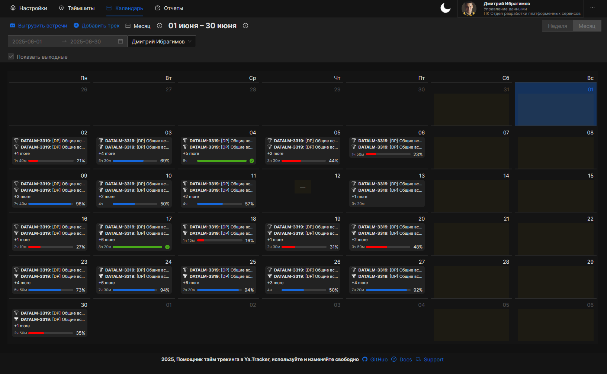
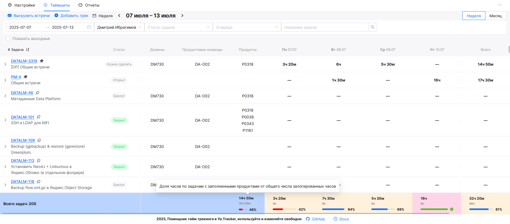
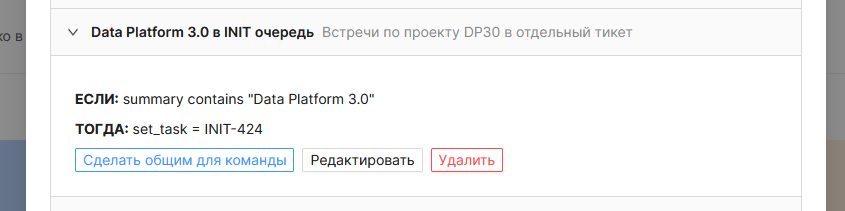

# Пользовательская документация

## **Адрес сервиса**: [https://timesheet.apps.data.lmru.tech](https://timesheet.apps.data.lmru.tech/)

## Цель сервиса

Сервис создан для упрощения ведения учета трудозатрат по задачам в Yandex Tracker. 

---

## ⚠️ Важно! Прежде чем начать

🔴 **Нельзя списывать все встречи на одну задачу**
Каждая встреча должна быть привязана к конкретной задаче, которая соответствует продукту или инициативе, по которой велась работа.
**Исключения** допустимы только для редких общекомандных встреч (например, Tech Community Meeting, открытый микрофон и т.д.).

🔴 **Не используйте задачу** `PM-4` или любую "свалку" по умолчанию для всех логов.
Это нарушает точность распределения затрат и затрудняет капитализацию.

🟡 **По умолчанию ключ задачи при импорте из календаря не подтягивается** — вы вводите его вручную.

🟢 **Логирование можно делать раз в неделю**, но при этом **нужно распределять часы по рабочим дням**, а не списывать весь объем на один день.

---

## ✅ Что можно делать в Timesheet

### 🔹 Новый календарный режим учета времени

Теперь на вкладке **Календарь** доступен современный интерактивный календарь для работы с треками:

- **Быстрое добавление трека:**
  - Для пустых рабочих дней (не выходных) отображается кнопка добавления трека. Кликните по ней, чтобы быстро создать новую запись.
- **Просмотр и детализация:**
  - Клик по дню с треками открывает модальное окно с подробностями по всем трекам за этот день.
- **Переход между месяцами:**
  - Можно переключать месяцы в календаре, автоматически подгружаются задачи и треки за выбранный период.
- **Отображение задач:**
  - В ячейках календаря показываются ключ задачи и её краткое описание.
- **Улучшенная навигация:**
  - Календарь всегда отображает актуальный месяц, а фильтры и отображение выходных дней синхронизированы с выбранным режимом.

**Преимущества:**
- Быстрое добавление треков прямо из календаря.
- Удобный просмотр и анализ треков по дням.
- Современный и наглядный интерфейс для планирования и учета времени.

---

### 🔹 Работа с задачами и треками

* Задачи отображаются, если:

  * Назначены на выбранного исполнителя (ты - по умолчанию).

  * Были обновлены в выбранный период.

  * Содержат треки выбранного исполнителя.

  * Были закреплены вручную (иконка 📌 рядом с ключом). 

* Можно выбирать исполнителя из команды (управляется через меню [Настройки](#-работа-с-командой)):

* Можно фильтровать по:

  * Статусу

  * Очереди

  * Названию

**Создание и редактирование треков:**

* Кликните по ячейке в таблице (пересечение задачи и даты).

* Или нажмите **Добавить трек (Add track)**.

* Редактируйте комментарий, дату и часы. Удалить можно через иконку 🗑️.

---

### 🔹 Вход и авторизация

* Авторизация происходит через ваш аккаунт в Yandex Tracker. На странице авторизации необходимо подтвердить доступ к чтению и записи в трекер.

* Если вы уже авторизованы в Tracker, то вход в Timesheet произойдет автоматически.

* Авторизация в календаре в меню Настройки (Settings) -\> Авторизация (Authorization). Почта заполняется автоматически из пользователя Yandex Tracker, менять её нельзя.  Введите **пароль от своего LDAP и нажмите Сохранить**.

---

### 🔹 Импорт встреч из календаря

1. Авторизоваться в календаре.

2. Нажать во вкладке **Таймшиты (Timsheets)** кнопку **Выгрузить встречи**.

3. Выбрать нужные встречи.

4. Указать ключ задачи для каждой встречи (например, `DATALM-1234`). Работает поиск, найти ключ можно по названию задачи.

5. Нажать **“Загрузить”** — встречи превратятся в превратятся в треки к выбранным задачам.

> ⛔️ Ключ задачи нужно ввести вручную для каждой встречи.

> 📌 Один ключ можно применить ко всем встречам, но **только если они действительно относятся к одной задаче**.

> 🧩 Есть возможность настраивать правила подстановки задач ко встречам, описание в разделе [Автоматические правила](#-автоматические-правила-по-умолчанию).

---

### 🔹 Автоматические правила (по умолчанию)

Сервис автоматически применяет ряд предустановленных правил для классификации и обработки встреч из календаря. Эти правила помогают корректно распределять встречи по задачам, округлять длительность и пропускать нерелевантные события. Также, **можно добавлять свои правила**.

**Список стандартных правил:**

- **Отпуск**  
  Все встречи с названием "Отпуск" автоматически устанавливаются на задачу `PM-2`.

- **Обучение**  
  Встречи, содержащие в названии слова "DE Talks", "BI Talks", "Meetup", "Обучение", "Тренинг", "Training", "Community", "Meeting", автоматически устанавливаются на задачу `PM-3`.

- **Общие встречи**  
  Встречи с числом участников больше 100 или с участием определённых рассылок (например, `ml.lmtech@lemanapro.ru`, `ml.all.co@lemanapro.ru` и др.), а также встречи с названиями вроде "Coffee talk", "Доклады и Докладчики", "Domain Review", "ТДК", "TDK" — автоматически устанавливаются на задачу `PM-4`.

- **Работа с людьми**  
  Встречи, содержащие в названии "МежБОРД", "БОРД", "Билан", "МежБилан", "Собес", "Interview", "Интервью", автоматически устанавливаются на задачу `PM-11`.

- **Округление длительности**  
  Встречи длительностью менее 30 минут автоматически округляются до 30 минут.  
  Встречи длительностью менее 1 часа — до 1 часа.

- **Пропуск встреч без участников**  
  Встречи без участников (и не являющиеся отпуском) автоматически пропускаются и не попадают в выгрузку.

> Вы можете изменить, удалить или дополнить эти правила в разделе "Правила" в настройках сервиса.

**Пример:**

| Название встречи         | Кол-во участников | Применённое правило         | Итоговая задача/действие |
|-------------------------|-------------------|-----------------------------|--------------------------|
| Отпуск                  | 1                 | Отпуск                      | PM-2                     |
| DE Talks: Data Science  | 20                | Обучение                    | PM-3                     |
| Общий митап             | 150               | Общие встречи               | PM-4                     |
| Собеседование           | 3                 | Работа с людьми             | PM-11                    |
| Короткая встреча        | 2                 | Округление длительности      | 30 минут                 |
| Пустая встреча          | 0                 | Пропуск встреч без участников| Пропущено                |

**Изменяйте правила под свои задачи для более точного распределения времени!**

Можно делиться созданными правилами со своей командой, нажав кнопку **"Сделать общим для команды"**:

---

### 🔹 Генерация правил с помощью ИИ (AI Rules Generation)

Теперь вы можете создавать автоматические правила для обработки встреч с помощью искусственного интеллекта прямо в интерфейсе Timesheet!

**Как это работает:**
- В разделе "Правила" появилась форма "Генерация правил с помощью ИИ".
- Опишите на естественном языке, какое правило вы хотите создать (например: _"Пропускать встречи с Иваном Петровм"_ или _"Установить задачу LMW-123 для встреч по созданию AI ассистентов"_).
- Нажмите кнопку **Сгенерировать правило**.
- Сервис отправит ваш запрос в ИИ и автоматически предложит готовое правило, которое вы сможете сразу добавить в список.

**Пример использования:**
1. Перейдите в раздел "Правила".
2. Введите описание правила в поле "Опишите встречу или правило на естественном языке".
3. Нажмите "Сгенерировать правило".
4. Если правило успешно сгенерировано, оно появится в списке ваших правил.
5. Если ИИ не смог создать правило, вы увидите причину ошибки.

**Стоимость и токены:**
- После каждого запроса ИИ отображается информационное сообщение о количестве использованных токенов и стоимости запроса (в рублях).
- Пример: _"Использовано токенов: 1200, стоимость запроса: 1.01 ₽"_.
- Даже если правило не было сгенерировано, информация о расходе токенов всё равно будет показана.

**Зачем это нужно:**
- Быстрое создание сложных правил без ручного ввода всех условий.
- Экономия времени и снижение ошибок при настройке автоматизации.

---

### 🔹 Просмотр треков и отчетов

* Вкладка **Отчеты (Reports)** показывает:

  * Общее количество залогированых часов.

  * Кто из команды не логировал (можно использовать для контроля).

  * Раскраска по дням (например, \>8 часов — красным). Для сокращенных и праздничных дней работает проверка на 7 и 0 часов соответственно.

* Поддерживаются выборки по периоду (неделя, месяц, произвольно).

> 🧩 Это **оперативный отчет**, а не финальный бухгалтерский. Он показывает текущее состояние логирования в реальном времени, напрямую выгружая треки с API Яндекса.

---

### 🔹 Работа с командой

* Добавление коллег вручную по логину (LDAP) или из очереди трекера (выгружаются все пользователи, указанные владельцем очереди в Yandex Tracker как **Команда очереди**) производится через меню **Настройки (Settings) -> Настройки команды (Team settings)**.

* Они появятся в списке пользователей и можно будет смотреть их треки (если есть к ним доступ в Яндекс.Трекере).

---

## 💡 Рекомендации по логированию

| Рекомендация                                                                | Почему это важно                                                |
| --------------------------------------------------------------------------- | --------------------------------------------------------------- |
| Вводить ключ задачи вручную для каждой встречи                              | Исключает массовое списание на “помойку”                        |
| Не превышать 8 часов логирования                                    | Это вызывает ошибки в отчетности и недоверие к данным           |
| Комментировать треки осмысленно                                              | Позволяет понять суть работы и использовать данные для анализа  |
| Закреплять задачи, если работаете над ними регулярно                       | Они будут всегда отображаться в таблице, даже без свежих треков |
| Проверять вкладку Отчеты (Reports) — смотреть сколько времени потрачено | Помогает  управлять ресурсами и устранять пробелы  |

---

## 🔍 Вопросы и помощь

Если у вас остались вопросы:

* Обратитесь к своему руководителю — он может показать, как логировать правильно.

* Или напишите в Telegram: [@diarworld](https://t.me/diarworld) .

---